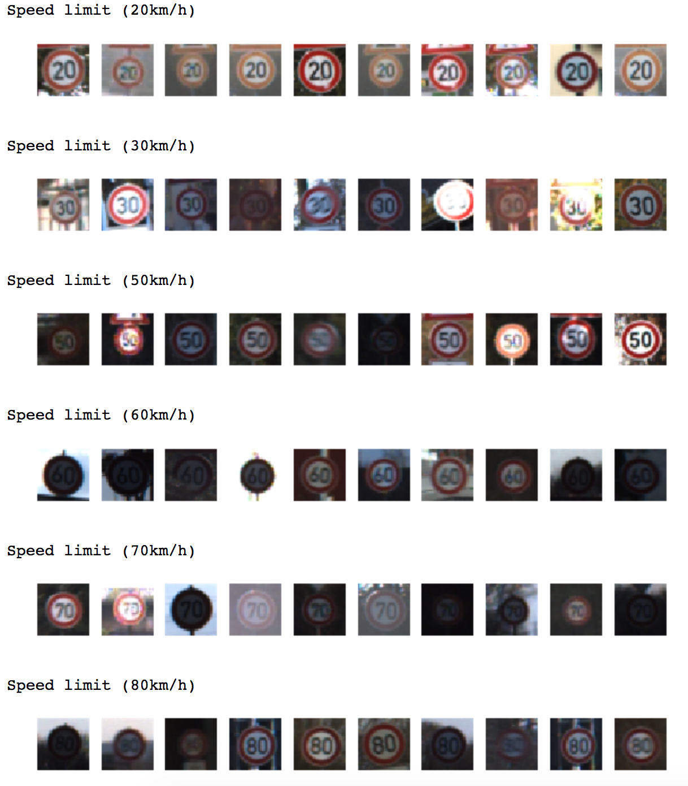
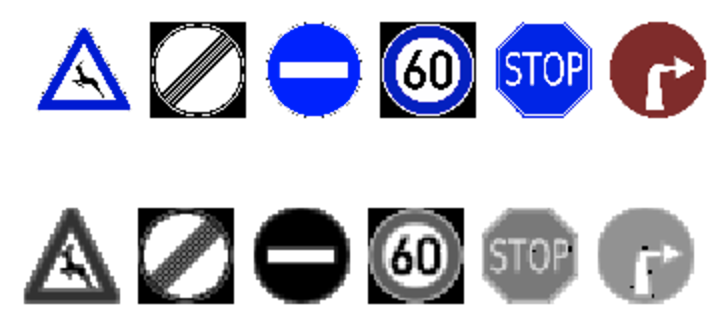

# **Traffic Sign Recognition** 

## Project Writeup

---

**Build a Traffic Sign Recognition Project**

The goals / steps of this project are the following:
* Load the data set (see below for links to the project data set)
* Explore, summarize and visualize the data set
* Design, train and test a model architecture
* Use the model to make predictions on new images
* Analyze the softmax probabilities of the new images
* Summarize the results with a written report

## Rubric Points
### Here I will consider the [rubric points](https://review.udacity.com/#!/rubrics/481/view) individually and describe how I addressed each point in my implementation.  

---
### Writeup / README

#### 1. Provide a Writeup / README that includes all the rubric points and how you addressed each one. You can submit your writeup as markdown or pdf. You can use this template as a guide for writing the report. The submission includes the project code.

You're reading it! Here is a link to my [project code](https://github.com/stridera/CarND-Traffic-Sign-Classifier-Project/blob/master/Traffic_Sign_Classifier.ipynb)

### Data Set Summary & Exploration

#### 1. Provide a basic summary of the data set and identify where in your code the summary was done. In the code, the analysis should be done using python, numpy and/or pandas methods rather than hardcoding results manually.

The code for this step is contained in the second code cell of the IPython notebook.  

I used the numpy library to calculate summary statistics of the traffic
signs data set:

* Number of training examples = 34799
* Number of testing examples = 12630
* Image data shape = (34799, 32, 32, 3)
 * 34,799 Images
 * 32x32 pixels
 * 3 Color Depth (RGB)
* Number of classes = 43

#### 2. Include an exploratory visualization of the dataset and identify where the code is in your code file.

The code for this step is contained in the third code cell of the IPython notebook.  

Here is an exploratory visualization of the data set. I first step through each data type and print the label with a selection of 10 images for each type.  This gives me a good idea of what I'm dealing with and what to expect.

(View the rest of the data on the project page.)

### Design and Test a Model Architecture

#### 1. Describe how, and identify where in your code, you preprocessed the image data. What tecniques were chosen and why did you choose these techniques? Consider including images showing the output of each preprocessing technique. Pre-processing refers to techniques such as converting to grayscale, normalization, etc.

The beginning of Step 2 
My initial preprocessing pipeline involved running it through the following steps:

* Grayscale
* Equalize (Between -0.5 and 0.5)
* Rotate (Randomly +/- 15deg)
* Warp
* Normalize

I first grayscale it to prevent color/shade/etc from adding additional hurdles to training the data.  While the color could possibly be a useful data point in the future, it would require a lot more data and training considerations.

Next I equalized the image to clean out some of the low colors and spread out the visual range to make detecting changes easier in the main channel range.

During the first passes, I added some jitter to the images by having it randomly rotate by +/- 15 degrees and applying a warp transformation.  This would make it so each epoch would be dealing with basically new data (warped versions of old images.)  However, after experimentation, I found that these functions would greatly increase the processing time while providing little or no improvement in the accuracy of the dataset.

Finally I normalize the image to help the contrast of the images.  It really helps the whites pop out.

Here is an example of a traffic sign image before and after preprocessing.

#### 2. Describe how, and identify where in your code, you set up training, validation and testing data. How much data was in each set? Explain what techniques were used to split the data into these sets.

The dataset includes a good portion of training, testing, and validation data sets.  The training set included nearly 35k images, with the test set containing nearly 13k images.  Since the portion of test to training was so high, I didn't feel the need to strip any additional images from the training set.  Additionally, I had nearly 5k images in the validation set that I used for final accuracy numbers.

#### 3. Describe, and identify where in your code, what your final model architecture looks like including model type, layers, layer sizes, connectivity, etc.) Consider including a diagram and/or table describing the final model.

The code for my final model is located in the **Model Architecture** section of the ipython notebook. 

My final model consisted of the following layers:

|Layer|Description|
|---|---| 
|Input|32x32x1 Grayscale image, Dropout Percentage| 
|||
|Convolution Layer 1|5x5 windows, 1x1 stride, VALID padding, outputs 28x28x16|
|RELU|activate1|
|Max pooling|2x2 stride, outputs 14x14x16|
|Dropout|Based on the Dropout Percentage.  I keep 80%|
||| 
|Convolution Layer 2|5x5 windows, 1x1 stride, VALID padding, outputs 10x10x32|
|RELU|activate2|
|Max pooling|2x2 stride, outputs 5x5x32|
|Dropout|Keep 80%|
|||
|Flatten|Flattens the 5x5x32 to 800|
|||
|Fully Connected Layer 1|inputs 800, outputs 512|
|RELU|activate3|
|||
|Fully Connected Layer 2|inputs 512, outputs 128|
|RELU|activate4|
|||
|Fully Connected Final Layer|inputs 128, outputs n_classes (43)|

#### 4. Describe how, and identify where in your code, you trained your model. The discussion can include the type of optimizer, the batch size, number of epochs and any hyperparameters such as learning rate.

The code for training the model is located in the **Train, Validate, and Test the Model** of the ipython notebook. 

For training I add the following operations to the logits:

|Layer|Function|Description|
|---|---|---|
|cross_entropy|tf.nn.softmax\_cross\_entropy\_with\_logits|Compute the Softmax Cross Entropy between the prediction and the labels.
|loss_operation|tf.reduce_mean|Grab the mean among all elements|
|optimizer|tf.train.AdamOptimizer.minimize (Learning Rate 0.001)|Optimizer that implements the Adam algorithm.  Computes the gradients and applies them.|

To train the model, I run it through two loops.  

The outside marks the epochs.  For each epoch, I shuffle and preprocess the images.  (I left preprocessing here in case I want to add the jitter back in.  This makes it add random jitter with each epoch.)  This helps train the model on just the images and not the order.

The inside loop handles the batch processing.  I know that batches are supposed to be used to allow large datasets to run on hardware with limited memory, but increasing this always lowered my accuracy.  I have a machine with 64GB memory and 2 1080Ti video cards (11G memory each) and the accuracy would drop if I increased the batch size.  I'm not sure why.

#### 5. Describe the approach taken for finding a solution. Include in the discussion the results on the training, validation and test sets and where in the code these were calculated. Your approach may have been an iterative process, in which case, outline the steps you took to get to the final solution and why you chose those steps. Perhaps your solution involved an already well known implementation or architecture. In this case, discuss why you think the architecture is suitable for the current problem.

The code for calculating the accuracy of the model is located in the ninth cell of the Ipython notebook.

My final model results were:

* training set accuracy of 99.8%
* validation set accuracy of 95.1%
* test set accuracy of 93.3%

**What was the first architecture that was tried and why was it chosen?**

The first approach I did was to blindly copy leNet and play with the model and numbers to see if I could get them to work.  I chose this model because they both looked at discrete images based on shape and whitespace and returned a discrete tiny output set.

**What were some problems with the initial architecture?**

It actually worked better than I expected initially.  I had to change the weights and layer depths, but even on the first run, I started around 80% on the first epoch and ended up over the 93% mark.

**How was the architecture adjusted and why was it adjusted?**
*Typical adjustments could include choosing a different model architecture, adding or taking away layers (pooling, dropout, convolution, etc), using an activation function or changing the activation function. One common justification for adjusting an architecture would be due to over fitting or under fitting. A high accuracy on the training set but low accuracy on the validation set indicates over fitting; a low accuracy on both sets indicates under fitting.*

I initially attempted to add more layers, but it only lowered my accuracy.  I did find out that by changing initial conv2d weights to use the xavier_initializer_conv2d() function instead.  It cleaned it up slightly and gave better results.

I also added a dropout to add a little bit more randomness to the model and help with the over-fitting.  I still think there is a little too much overfitting and think I should do some things like equalize the input classes to help prevent one class from overfitting over other classes.

**Which parameters were tuned? How were they adjusted and why?**

I adjusted the weights to handle the new input size.  I played around with batch size and epochs, and found that 128 batch size brought it to the max quickest, and I've never seen benefits beyond 10 epochs, however, I kept it around 15 since it's quick.

### Test a Model on New Images

#### 1. Choose five German traffic signs found on the web and provide them in the report. For each image, discuss what quality or qualities might be difficult to classify.

The image I showed earlier highlights the six German traffic signs that I found on the web, resized and pre-post processing:

**1. Wild Animal Crossing**

I full expect this image to be classified correctly.  It has a clear border and the image is very clean.  It might be too clean compared to the classifier data, but it should be fine.

**2. End of All Speed Limits**

This is a PNG file, and the transparent background is seen as a black field when read in.  It should still detect the edges fine, but I wonder if this could cause issues when read in.  Also, since the circle goes directly to the edge, it might not see the edges correctly and misclassify.

**3. No Entry**

This is another one that I expect to be classified correctly.  Again, this goes to the edge of the image, so it might cause some issues if we trained everything to have a border.

**4. Speed Limit - 60km/h**

This is another image with a transparent background that is being seen as black.  With the color data, however, it does give a nice contrast between the black and the sign, so hopefully it won't affect it.  Another image where I could probably get better results if I add a small border around it.

**5. Stop**

This image has some weird black spots in the image that I don't see on the source, however, it should be clean otherwise.  This is another image that might be misclassified due to the edges of the sign going to the edge of the window.  In fact, I think this is highly likely with this sign since half the outside edges can be missed due to this.

**6. Turn Right**

Another image with weird black spots on it.  However, since this is a circular image, I think it should be classified correctly with no concerns to the image going to the edge.

#### 2. Discuss the model's predictions on these new traffic signs and compare the results to predicting on the test set. Identify where in your code predictions were made. At a minimum, discuss what the predictions were, the accuracy on these new predictions, and compare the accuracy to the accuracy on the test set (OPTIONAL: Discuss the results in more detail as described in the "Stand Out Suggestions" part of the rubric).

The code for making predictions on my final model is located in the 15th cell of the Ipython notebook.

Here are the results of the prediction:

| Image			        |     Prediction	        					| 
|:---------------------:|:---------------------------------------------:| 
| Wild Animal Crossing | Wild animals crossing | 
| End of all speed and passing limits |End of all speed and passing limits|
| No entry | No entry |
| Speed limit (50km/h) | Speed limit (60km/h) |
| Stop | Speed limit (100km/h) |
| Turn Right | Turn Right |

The model was able to correctly guess 4 of the 6 traffic signs, which gives an accuracy of 66%. This compares modestly to the rest of the data set.  I'm thinking a few more steps of preparing the data for overfitting may have helped this.

#### 3. Describe how certain the model is when predicting on each of the five new images by looking at the softmax probabilities for each prediction and identify where in your code softmax probabilities were outputted. Provide the top 5 softmax probabilities for each image along with the sign type of each probability. (OPTIONAL: as described in the "Stand Out Suggestions" part of the rubric, visualizations can also be provided such as bar charts)

The code for showing predictions on my final model is located in the 17th cell of the Ipython notebook.

The first image, showing the wild animal crossing was correctly identified at 99%.  Since there are so many triangle signs, I'm happy of this result.

	Top 5 class predictions for deer.png:
		Correct ID: 31, label: Wild animals crossing
		Predicted ID 1: 31, label: Wild animals crossing, probability: 0.9977903366
		Predicted ID 2: 21, label: Double curve, probability: 0.0022096627
		Predicted ID 3: 25, label: Road work, probability: 0.0000000044
		Predicted ID 4: 11, label: Right-of-way at the next intersection, probability: 0.0000000006
		Predicted ID 5: 2, label: Speed limit (50km/h), probability: 0.0000000000
	
Likewise, sign two is also correctly predicted at 99%.  This sign is pretty unique and I expected this.
	
	Top 5 class predictions for end_of_speed_limit.png:
		Correct ID: 32, label: End of all speed and passing limits
		Predicted ID 1: 32, label: End of all speed and passing limits, probability: 0.9998795986
		Predicted ID 2: 41, label: End of no passing, probability: 0.0000974746
		Predicted ID 3: 12, label: Priority road, probability: 0.0000119498
		Predicted ID 4: 6, label: End of speed limit (80km/h), probability: 0.0000109458
		Predicted ID 5: 42, label: End of no passing by vehicles over 3.5 metric tons, probability: 0.0000000016

Next we have a prediction of 100%.  Again, since this sign is pretty unique, it seems faily happy to identify these types of signs.

	Top 5 class predictions for no_entry.png:
		Correct ID: 17, label: No entry
		Predicted ID 1: 17, label: No entry, probability: 1.0000000000
		Predicted ID 2: 9, label: No passing, probability: 0.0000000000
		Predicted ID 3: 34, label: Turn left ahead, probability: 0.0000000000
		Predicted ID 4: 12, label: Priority road, probability: 0.0000000000
		Predicted ID 5: 41, label: End of no passing, probability: 0.0000000000

Here we have our first mis-classification.  It detects with a nearly 99% certainty that this is a 50km/h.  The correct sign is less than 1% sure.  I'm wondering if this is because there are nearly double the samples of 50km/h signs than 60km/h signs.

	Top 5 class predictions for speed_60.png:
		Correct ID: 3, label: Speed limit (60km/h)
		Predicted ID 1: 2, label: Speed limit (50km/h), probability: 0.9891434312
		Predicted ID 2: 1, label: Speed limit (30km/h), probability: 0.0094657224
		Predicted ID 3: 3, label: Speed limit (60km/h), probability: 0.0013556530
		Predicted ID 4: 5, label: Speed limit (80km/h), probability: 0.0000211115
		Predicted ID 5: 6, label: End of speed limit (80km/h), probability: 0.0000126208
		
This sign is also misclassified as a Speed Limit sign instead of the stop sign.  Again, this could be because there are twice the number of 100km/h signs than stop signs.
		
	Top 5 class predictions for stop.png:
		Correct ID: 14, label: Stop
		Predicted ID 1: 7, label: Speed limit (100km/h), probability: 0.5926347971
		Predicted ID 2: 8, label: Speed limit (120km/h), probability: 0.2349927723
		Predicted ID 3: 14, label: Stop, probability: 0.0733116344
		Predicted ID 4: 2, label: Speed limit (50km/h), probability: 0.0246236026
		Predicted ID 5: 3, label: Speed limit (60km/h), probability: 0.0145295225
		
Finally, we end up with another correct prediction at a certainty of 62%.  Road work is a step down at 31%.  Both of these have relatively equivelent sample sizes.
		
	Top 5 class predictions for turn_right.png:
		Correct ID: 33, label: Turn right ahead
		Predicted ID 1: 33, label: Turn right ahead, probability: 0.6259540319
		Predicted ID 2: 25, label: Road work, probability: 0.3133167326
		Predicted ID 3: 12, label: Priority road, probability: 0.0514953658
		Predicted ID 4: 40, label: Roundabout mandatory, probability: 0.0058587710
		Predicted ID 5: 11, label: Right-of-way at the next intersection, probability: 0.0016231728
